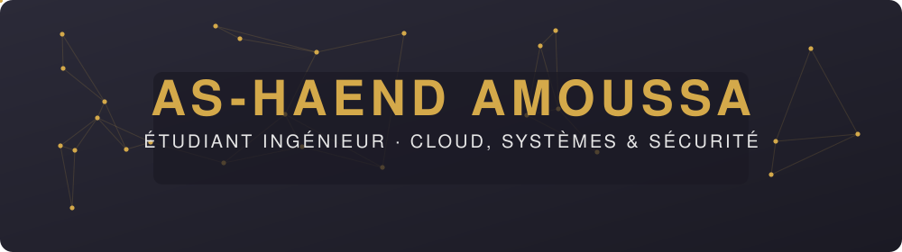
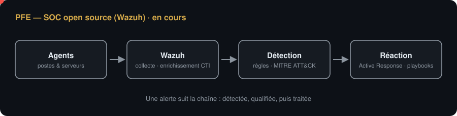

## 🧭 Mes domaines

## 🛠️ Projets

<b>🛡️ Projet ETC — ESEO Teaching Cloud</b> · sept. 2025 – juin 2026 · équipe de 5

 

**Référent sécurité de l'équipe**

- Identification et hiérarchisation des actifs critiques de l'infrastructure
- Politique de sécurité inspirée des référentiels ANSSI
- Pare-feu **OPNsense** : filtrage par défaut, NAT/PAT, accès VPN
- **Routeur et switch Cisco** : segmentation en VLAN, routage inter-VLAN (802.1Q) et ACL de filtrage
- Tests de sécurité documentés et procédure de gestion d'incident

<b>🔍 PFE — SOC open source (Wazuh)</b> · 2026 – 2027 · en cours · équipe de 5

 

- **Qualification** : agents, agrégation et enrichissement des logs (CTI)
- **Détection** : modélisation MITRE ATT&CK, règles comportementales
- **Réaction** : Active Response, playbooks, intégration SOAR

<b>⚙️ Infrastructure haute disponibilité</b> · 2025 – 2026 · projet de cours

 

- Répartition de charge **HAProxy** actif/passif devant 3 serveurs Apache
- Base **MariaDB Galera** répliquée, stockage NFS/DRBD avec Pacemaker
- 10 machines virtuelles déployées avec Vagrant / VirtualBox

<b>🧪 Labs & TP 2026 – 2027</b>

 

| Module | Ce que j'y fais | État |
|---|---|---|
| VMware | ESXi, réseau virtuel | 🟡 en cours |
| Cryptographie | Chiffrements de César, affine, par substitution | ✅ |
| Sécurité des échanges | Serveur SSH isolé dans un namespace réseau | ✅ |
| Docker / Kubernetes | Conteneurisation et orchestration | 🟡 en cours |
| Sécurité offensive | — | ⏳ à venir |
| OpenStack | — | ⏳ à venir |
| CI/CD GitLab | — | ⏳ à venir |
| Supervision SOC | — | ⏳ à venir |

## 🗺️ Parcours

## 📜 Certifications

## 📫 Me contacter

